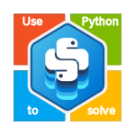
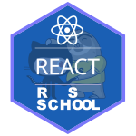
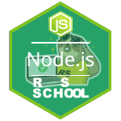
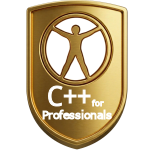
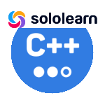
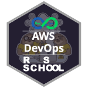
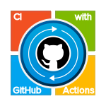
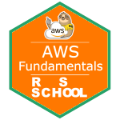
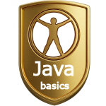
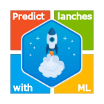

# 🌱 I've learned  

              

<!---
- 👋 Hi, I’m @Val-d-emar
- 👀 I’m interested in ...
- 🌱 I’m currently learning ...
- 💞️ I’m looking to collaborate on ...
- 📫 How to reach me ...
Val-d-emar/Val-d-emar is a ✨ special ✨ repository because its `README.md` (this file) appears on your GitHub profile.
You can click the Preview link to take a look at your changes.
--->
